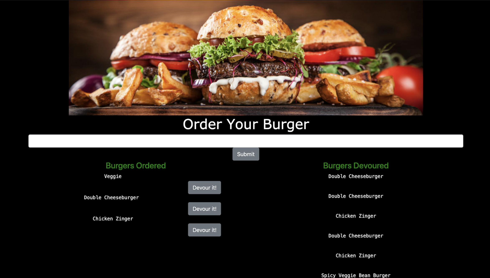
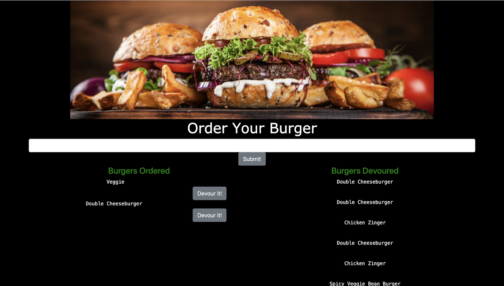

### Node Express Handlebars

Eat da burger! is a restaurant app that lets users input the names of burgers they'd like to eat. 

## Overview
In this assignment, I created a burger logger with MySQL, Node, Express, Handlebars and a homemade ORM. I was sure to follow the MVC design pattern; using Node and MySQL to query and route data in this app, and Handlebars to generate a HTML.

Whenever a user submits a burger's name, this app will display the burger on the left side of the page -- waiting to be devoured.

Each burger in the waiting area also has a Devour it! button. When the user clicks it, the burger will move to the right side of the page.

This app will store every burger in a database, whether devoured or not.

## Screenshots

## Installation
To run the application locally, first clone this repository with the following command.

git clone https://nikstar-1.github.io/burger-app/.

Next, install the application dependencies.

cd eat-da-burger
npm install
Finally, run the node server locally.

node server
Now, open the local application on port 3000 at the URL: http://localhost:3000/.

Below is my Heroku link for direct access:
https://still-atoll-89134.herokuapp.com/burgers

Enjoy and have a burger!

## Technologies Used
MySQL
Node.js
Express
Handlebars

